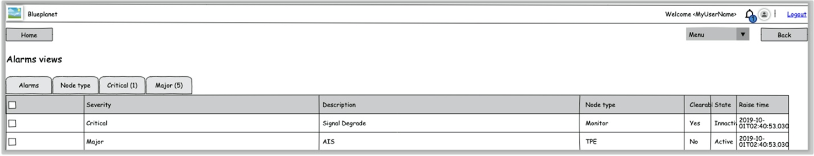
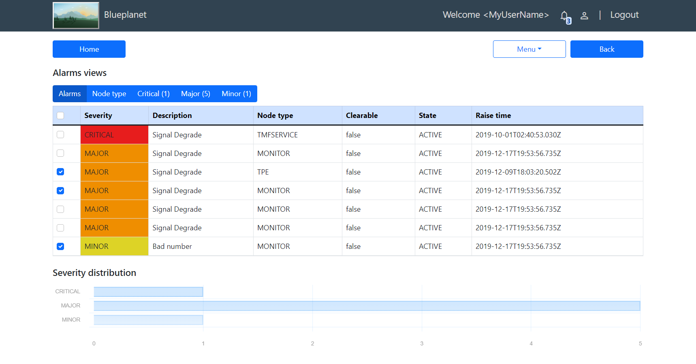

# Ciena Assignment

By William Décoste \
<widec@me.com>

## Screen to reproduce

## Solution

## Available Scripts

Navigate to the ciena-assignment folder (the root of the Angular project).

Run `npm install`.

Run `ng serve --open` to run the server and a web page should open at `http://localhost:4200/`.
Otherwise, run `ng serve` and navigate to `http://localhost:4200/`.
